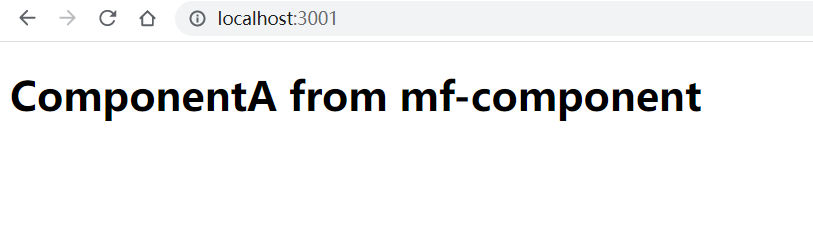

# webpack-module-federation-shared-lib-example
webpack module federation shared lib example

## usage

serve shared libs and components 

```
cd mf-component
npm i
npm run start
```

start app that use shared libs and components (another shell)

```
cd mf-app
npm i
npm run start
```

open http://localhost:3001




